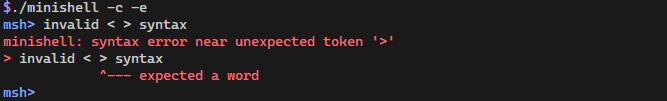

# minishell

Overcomplicated, as all things should be.

Use `make help` for build instructions. (GNU Make 4.2.1+ required)

## Missing features

* <kbd>Ctrl</kbd> + <kbd>C</kbd> does not exit heredoc

## Extra features

* Colored output

    Enable: `-c` (`--use-colors`) or `export MSH_USE_COLORS`  
    Disable: `unset MSH_USE_COLORS`

    
    

* Detailed error messages:

    Enable: `-e` (`--detailed-errors`) or `export MSH_USE_DETAILED_ERRORS`  
    Disable: `unset MSH_USE_DETAILED_ERRORS`

    
    

* Implicit cat:

    Use `/usr/bin/cat` instead of no-op when no command is specified (zsh feature).

    Enable: `-i` (`--implicit-cat`) or `export MSH_USE_IMPLICIT_CAT`  
    Disable: `unset MSH_USE_IMPLICIT_CAT`

    
    
